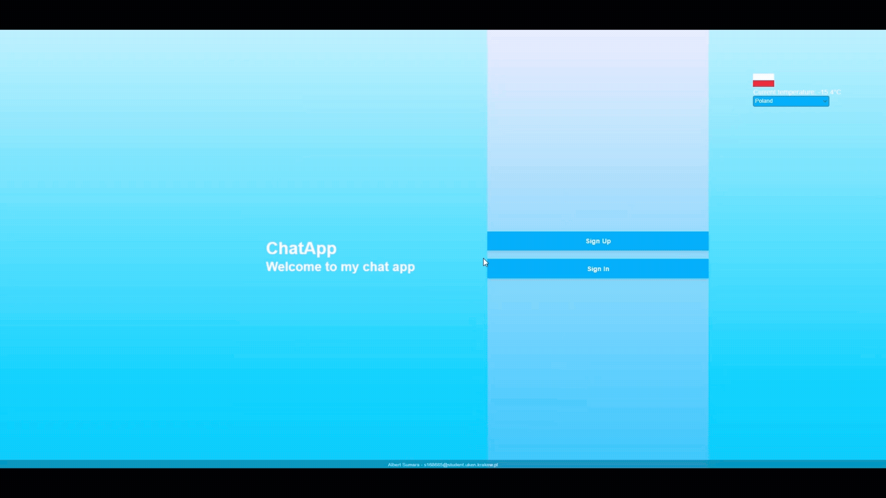

# ChatApp – Internetowy komunikator / Internet Chat Application

## [ENG] ChatApp – Internet Chat Application

It is a simple web chat application that allows users to exchange messages in real-time, with additional weather and country info features.

### Project Preview
You can try the application live here: [ChatApp Preview](https://chatapp-hydy.onrender.com)

### Technologies
- **Java**
- **Spring Boot**
- **PostgreSQL (running in Docker)**
- **REST API**

### How it works

**Chat**
- Users can register and log in (authentication system implemented manually),
- Logged-in users are stored in the browser session,
- Users can send messages to each other within the application.

**API**
- The application uses two APIs:
  - **Weather API** – displays current weather,
  - **Countries API** – provides a list of countries for selecting weather,
- Both APIs are integrated so users can quickly see weather for a selected country.

**Database**
- All user and message data is stored in a **PostgreSQL** relational database running in Docker.

### Project Goal
The goal was to practice:
- Web application development with Spring Boot backend,
- User authentication and session management in the browser,
- Integration with external APIs (weather + countries),
- Working with relational databases in PostgreSQL.

### Project Status
Completed as part of coursework, no longer under active development.

---

## [PL] ChatApp – Internetowy komunikator

Jest to prosta aplikacja webowa typu chat, pozwalająca użytkownikom na wymianę wiadomości w czasie rzeczywistym, z dodatkowymi funkcjonalnościami pogodowymi i informacyjnymi.

### Podgląd projektu
Możesz zobaczyć aplikację online tutaj: [ChatApp Preview](https://chatapp-hydy.onrender.com)

### Technologie
- **Java**
- **Spring Boot**
- **PostgreSQL (uruchomiony w Dockerze)**
- **REST API**

### Jak działa aplikacja

**Chat**
- użytkownicy mogą się rejestrować i logować (system stworzony samodzielnie),
- zalogowany użytkownik jest przechowywany w sesji przeglądarki,
- można wysyłać wiadomości między użytkownikami w obrębie aplikacji.

**API**
- aplikacja korzysta z dwóch API:
  - **pogodowego** – wyświetla aktualną pogodę,
  - **listy krajów** – umożliwia wybranie kraju, dla którego wyświetlana jest pogoda,
- oba API są spięte w jedno, dzięki czemu użytkownik może szybko zobaczyć pogodę dla wybranego kraju.

**Baza danych**
- wszystkie dane użytkowników i wiadomości są przechowywane w relacyjnej bazie danych **PostgreSQL** działającej w Dockerze.

### Cel projektu
Celem było praktyczne połączenie:
- aplikacji webowej z backendem w Spring Boot,
- logowania i sesji użytkownika w przeglądarce,
- integracji z zewnętrznymi API (pogoda + lista krajów),
- pracy z relacyjną bazą danych w PostgreSQL.

### Status projektu
Projekt zakończony w ramach zajęć, nie jest obecnie rozwijany.
